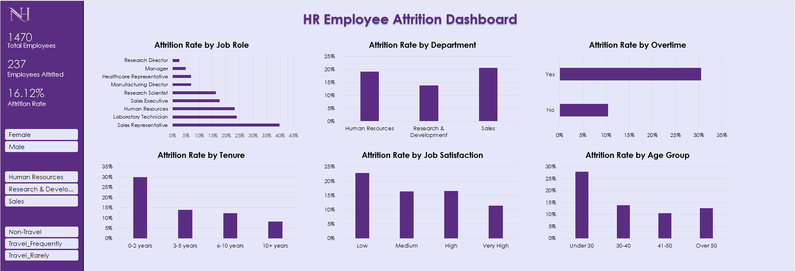

# HR Employee Attrition Analysis

An end-to-end people analytics project identifying the key drivers of employee attrition, using SQL, Excel and the IBM HR Analytics dataset framed around a fictional company.

---

## Project Overview

| | |
|---|---|
| **Dataset** | [IBM HR Analytics Employee Attrition & Performance](https://www.kaggle.com/datasets/pavansubhasht/ibm-hr-analytics-attrition-dataset) |
| **Rows** | 1,470 employees |
| **Overall Attrition Rate** | 16.12% (237 out of 1,470 employees) |

---

## Tools Used

- **MySQL** — data preparation, business queries, segmentation and advanced analysis (window functions, CTEs, subqueries)
- **Excel (Microsoft 365)** — pivot tables, interactive dashboard with slicers

---

## Repository Structure

```
hr-attrition-analysis/
│
├── data/
│   └── HR-Employee-Attrition.csv
│
├── sql/
│   ├── 01_Renaming_and_Adding_Column_Name.sql
│   ├── 02_Overall_attrition_rate.sql
│   ├── 03_Attrition_rate_by_dept.sql
│   ├── 04_Attrition_rate_by_jobrole.sql
│   ├── 05_Attrition_rate_by_age_group.sql
│   ├── 06_LeaversVSstayers_avg_salary.sql
│   ├── 07_Attrition_rate_by_overtime.sql
│   ├── 08_Attrition_rate_by_JobSatisfaction.sql
│   ├── 09_Attrition_by_tenure.sql
│   ├── 10_compensation_gap_by_role.sql
│   ├── 11_attrition_rank_by_role_within_department.sql
│   └── 12_future_risk_employees.sql
│
├── excel/
│   └── Dashboard.xlsx
│   └── screenshot.png
│
└── README.md
```

---

## Key Findings

**1. Sales and HR are the highest-risk departments.**
Sales has the highest attrition rate at 20.63%, followed by HR at 19.05%. Both exceed the company average of 16.12%. R&D has the lowest at 13.84% despite being the largest department (961 of 1,470 employees).

**2. Sales Representatives leave at more than double the company average.**
Sales Representatives have an attrition rate of 39.76% — the highest of any role. Laboratory Technicians (23.94%) and HR staff (23.08%) also significantly exceed the average. By contrast, Managers (4.90%) and Research Directors (2.50%) show the strongest retention, suggesting seniority is a strong stabilising factor.

**3. Overtime is the single strongest attrition signal.**
Employees working overtime leave at 30.53% versus 10.44% for those who do not — nearly 3x higher. Workload management is likely a critical retention lever.

**4. Early-career employees are the highest flight risk.**
Employees under 30 have an attrition rate of 27.91%, nearly double the company average. The 30–40 group drops to 13.84% and the 41–50 group to 10.56%, showing a clear inverse relationship between age and attrition.

**5. Attrition is heavily concentrated in the first two years.**
Employees with 0–2 years tenure leave at 29.82%, falling steadily to 8.13% for those with 10+ years. Employees who left also averaged fewer years in their current role (2.90 vs 4.48) and less time since their last promotion (1.95 vs 2.23 years).

**6. Job satisfaction is inversely correlated with attrition.**
Employees with the lowest satisfaction score (1) leave at 22.84%, while those with the highest score (4) leave at 11.33% — roughly half the rate. Targeted intervention for low-satisfaction employees could meaningfully reduce turnover.

**7. The overall salary gap between leavers and stayers is a composition artifact, not a compensation signal.**
On the surface, employees who left earned an average of $4,787/month versus $6,832 for those who stayed. However, when controlled for job role, the pattern disappears — in 4 of 9 roles, employees who left actually earned more than those who stayed. High-attrition roles (Laboratory Technician, Sales Representative, Research Scientist) are inherently low-paying, pulling down the leaver average.

**8. Compensation gap within departments is a consistent attrition driver.**
Among employees who earned below their department average and still left: Laboratory Technicians (62 leavers, avg $2,919) and Research Scientists (47 leavers, avg $2,780) dominate R&D, against a dept average of $6,281. In Sales, Representatives averaged only $2,365 against a dept average of $6,959. This within-role pay gap is a more precise signal than the overall salary comparison.

**9. 26 currently active employees meet all three high-risk criteria.**
Using a CTE to flag employees with no promotion in 3+ years, job satisfaction of 1 or 2, and active overtime: 21 of 26 are in R&D, 5 in Sales. Notably, 5 managers earning above $16,000/month appear in this list — confirming that high compensation does not offset stagnation and burnout. The longest-stalled employee has gone 15 years without a promotion while still working overtime.

---

## Dashboard Preview

### Excel Interactive Dashboard


*(Slicers: Gender, Department, BusinessTravel — filters all 6 visuals simultaneously)*

---

## Business Recommendations

- **Prioritise retention efforts in Sales** — specifically Sales Representatives, who leave at 39.76%. Investigate compensation structure, workload, and career progression pathways for this role.
- **Audit overtime policies** — the 3x attrition multiplier for overtime employees makes workload management one of the highest-ROI retention levers available.
- **Strengthen onboarding and early career development** — 29.82% attrition in the first 2 years suggests the company loses a significant number of employees before they fully contribute. Structured 90-day onboarding and clear promotion timelines in year 1–2 are likely to reduce this.
- **Act on the 26-employee watchlist** — the CTE in Query 12 surfaces an actionable list of at-risk employees. Promotion reviews and workload relief for this group should be prioritised before they become attrition statistics.
